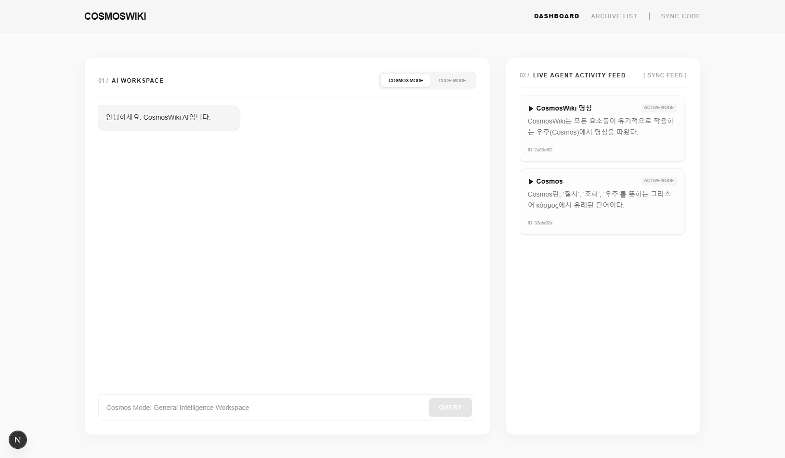
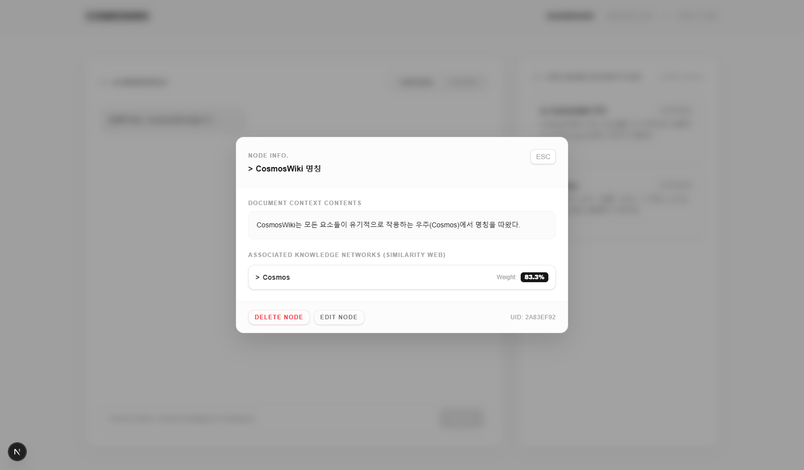
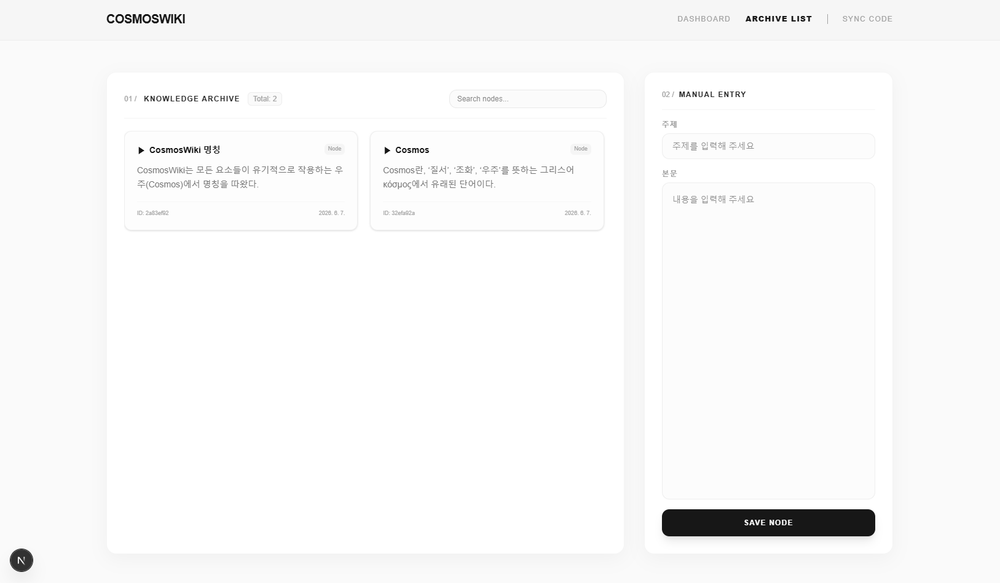

# CosmosWiki

CosmosWiki는 **Graph RAG (Graph-Augmented Retrieval-Augmented Generation)** 기반의 프로젝트 이해 및 지식 통합 AI 어시스턴트 플랫폼입니다.

기존의 벡터 검색 기반 RAG 시스템이 문서 단위의 의미 검색에 집중하는 반면, CosmosWiki는 소스코드 내 파일, 함수, 모듈 간의 구조적 관계를 그래프로 저장하고 활용하여 프로젝트 수준의 맥락(Context)을 유지합니다.

이를 통해 단순한 코드 검색을 넘어 복잡한 프로젝트 구조를 이해하고, 장기적인 개발 맥락을 유지하며, 프로젝트 전용 AI 에이전트로 활용할 수 있습니다.

---

## Why CosmosWiki?

기존 코드 기반 RAG 시스템은 다음과 같은 한계를 가지고 있습니다.

* 파일 단위 검색에 의존
* 프로젝트 전체 구조에 대한 이해 부족
* 장기적인 개발 맥락 유지 어려움
* 함수 및 모듈 간 관계 정보 활용 부족

CosmosWiki는 이러한 문제를 해결하기 위해 다음과 같은 접근 방식을 채택했습니다.

* 소스코드 정적 분석 기반 Blueprint 생성
* 함수 및 모듈 단위 관계선(Dependency Graph) 구축
* Graph RAG 기반 컨텍스트 확장
* 프로젝트 전용 장기 기억(Memory) 시스템
* AI 에이전트 중심 프로젝트 탐색 환경 제공

---

## Key Features

### Graph RAG 기반 프로젝트 이해

소스코드의 구조적 관계를 그래프로 저장하고 활용하여 단순 의미 검색을 넘어 프로젝트 전체 맥락을 추론합니다.

### Source Code Blueprint

파일, 함수, 시그니처, 의존성 정보를 정적 분석하여 프로젝트 청사진(Blueprint)을 생성합니다.

### Dependency Graph Tracking

모듈 간 Import 관계를 추적하여 프로젝트 구조를 데이터베이스 수준에서 관리합니다.

### Local Directory Sync

로컬에 존재하는 프로젝트 폴더(`workspace/`)를 백엔드가 직접 재귀 스캔하고 `ast` 모듈로 정적 분석하여, 별도의 파일 업로드 없이 즉시 DB에 동기화할 수 있습니다.

### Long-Term Project Memory

프로젝트 관련 지식 노드를 장기적으로 저장하고 연결하여 지속적인 컨텍스트를 유지합니다.

### Dual AI Modes

#### Cosmos Mode

범용 지식 탐색 모드입니다.

프로젝트 데이터가 존재하지 않는 경우에도 일반적인 지식 질의응답, 아이디어 탐색, 기술 조사 등을 수행할 수 있습니다.

※ 현재 버전은 외부 인터넷 검색 기능을 제공하지 않으며, 모델의 내장 지식과 저장된 메모리를 기반으로 응답합니다.

#### Code Mode

프로젝트 전용 분석 모드입니다.

Blueprint, Source Code, Dependency Graph, Episodic Memory를 활용하여 특정 프로젝트의 구조와 구현 내용을 분석합니다.

---

## Screenshots

CosmosWiki의 주요 기능 및 인터페이스 예시입니다.

### Main Workspace

CosmosWiki의 메인 작업 공간입니다.

AI와 대화하며 지식을 생성하고, 생성된 Node를 실시간으로 확인할 수 있습니다.

<p align="center">
  
</p>

### Knowledge Node Details

Node의 상세 정보를 확인할 수 있습니다.

제목, 내용, 연결된 노드 목록 및 각 노드와의 유사도를 확인할 수 있습니다.

또한 Node를 수정하거나 삭제할 수 있으며, 수정 시 기존 관계를 다시 평가하여 새로운 관계를 자동으로 구성합니다.

<p align="center">
  
</p>

### Knowledge Archive

생성된 Node 목록을 탐색할 수 있습니다.

제목과 내용을 직접 입력하여 새로운 지식 Node를 생성하고 관리할 수 있습니다.

<p align="center">
  
</p>

---

## Project Structure

```text
CosmosWiki
│
├─ backend/             FastAPI API 서버 (SQLite 로컬 DB 포함)
├─ frontend/            Next.js 기반 웹 인터페이스
├─ workspace/           로컬 동기화 대상 코드 폴더 (기본값)
│
├─ .env.example
├─ run.py
├─ README.md
└─ LICENSE
```

---

## Prerequisites

* Python 3.10+
* Node.js 18+
* npm

---

## Local Database

CosmosWiki는 외부 데이터베이스 없이 로컬 SQLite 파일(`backend/data/cosmos.db`) 하나로 동작합니다.

백엔드 서버를 처음 실행하면 8개 테이블과 인덱스가 자동으로 생성되므로 별도의 초기화 작업이 필요하지 않습니다. 저장 경로는 `.env`의 `LOCAL_DB_PATH`로 변경할 수 있습니다.

---

## Quick Start

### 1. Repository Clone

```bash
git clone https://github.com/nameless767304/CosmosWiki
cd CosmosWiki
```

### 2. Environment Variables

```bash
cp .env.example .env
```

`.env`

```env
GEMINI_API_KEY=YOUR_GEMINI_API_KEY

# 비워두면 backend/data/cosmos.db를 기본값으로 사용합니다.
LOCAL_DB_PATH=

NEXT_PUBLIC_BACKEND_URL=http://localhost:8000
```

### 3. Install Dependencies

Backend

```bash
pip install -r backend/requirements.txt
```

Frontend

```bash
cd frontend
npm install
cd ..
```

### 4. Run CosmosWiki

```bash
python run.py
```

`run.py`는 다음 작업을 자동 수행합니다.

* 환경 변수 동기화
* Backend 서버 실행
* Frontend 서버 실행
* 종료 시 안전한 프로세스 정리

---

## Local Services

Frontend

```text
http://localhost:3000
```

Backend API Docs

```text
http://127.0.0.1:8000/docs
```

---

## License

CosmosWiki는 MIT License 하에 배포됩니다.

자세한 내용은 LICENSE 파일을 참고하십시오.
